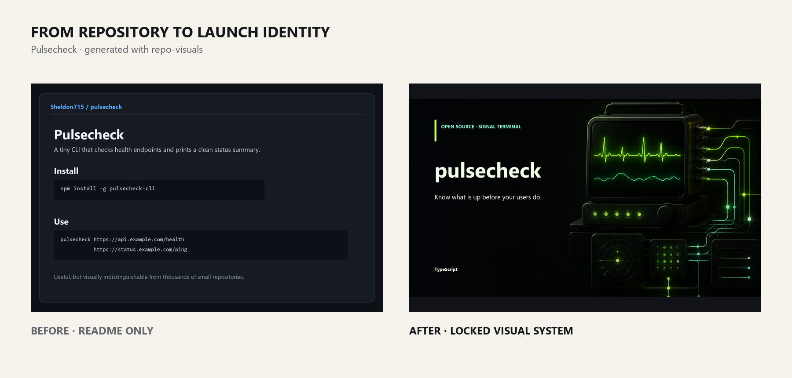
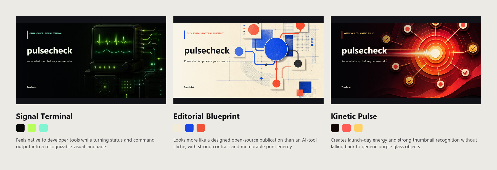
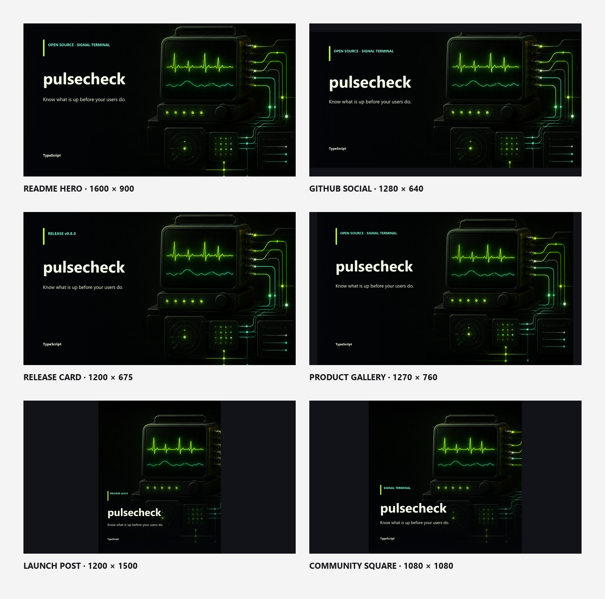

# repo-visuals

Turn an open-source repository into a launch-ready visual identity.

[](https://github.com/Sheldon715/repo-visuals)
[](LICENSE)

`repo-visuals` is an Agent Skill that reads public repository context, proposes three genuinely different art directions, locks one reusable visual system, and exports six launch assets with exact local typography.



## Three directions, not three colorways

The Skill starts with distinct visual concepts instead of committing to the first attractive image. Each direction includes its own composition, palette, rationale, and text-free generation prompt.



The chosen direction becomes a `visual-lock.json`: the source of truth for palette, copy, layout, artwork, and future release updates.

## One identity, six useful assets



| Asset | Size | Typical use |
| --- | ---: | --- |
| README hero | 1600 × 900 | Repository landing page |
| GitHub social preview | 1280 × 640 | Link unfurls and sharing |
| Release card | 1200 × 675 | Releases and changelogs |
| Product gallery | 1270 × 760 | GitHub and marketplace galleries |
| Launch post | 1200 × 1500 | Social launch posts |
| Community square | 1080 × 1080 | Community directories and announcements |

AI creates the artwork; deterministic Pillow scripts add the real project name, tagline, release, crop, contrast, and dimensions. The image model never needs to spell your product copy.

## Install

Install the Skill from GitHub:

```bash
npx skills add Sheldon715/repo-visuals@repo-visuals
```

Or copy `skills/repo-visuals` into the skills directory used by your agent, then install the local compositor dependency:

```bash
python -m pip install Pillow
```

Python 3.11 or newer is required.

## Use

Ask your agent:

```text
Use $repo-visuals to create a launch identity for this repository.
Show me three distinct directions before producing the final kit.
```

You can preserve existing brand constraints:

```text
Use $repo-visuals for v1.4.0. Keep our logo and cobalt blue,
but make the three concepts editorial, technical, and kinetic.
```

The workflow is:

1. inspect public-facing repository metadata and infer the project type;
2. plan three distinct visual directions;
3. generate one text-free master artwork for each direction;
4. compare GitHub social previews on a direction board;
5. lock the selected system in `visual-lock.json`;
6. export six exact assets and a QA contact sheet.

Generated files default to `output/repo-visuals/` in the target project. Repository source stays local; only the compact visual prompt and explicitly selected references go to the configured image-generation tool.

## Run the deterministic pipeline directly

Create a repository manifest and direction plan:

```bash
python skills/repo-visuals/scripts/inspect_repo.py . \
  --out output/repo-visuals/manifest.json

python skills/repo-visuals/scripts/plan_directions.py \
  --manifest output/repo-visuals/manifest.json \
  --out output/repo-visuals/directions.json
```

After generating a text-free background for the selected direction:

```bash
python skills/repo-visuals/scripts/lock_direction.py \
  --manifest output/repo-visuals/manifest.json \
  --directions output/repo-visuals/directions.json \
  --select signal-terminal \
  --background path/to/background.png \
  --out output/repo-visuals/visual-lock.json

python skills/repo-visuals/scripts/compose_visual.py \
  --lock output/repo-visuals/visual-lock.json \
  --background path/to/background.png \
  --out-dir output/repo-visuals

python skills/repo-visuals/scripts/build_contact_sheet.py \
  --input-dir output/repo-visuals \
  --out output/repo-visuals/contact-sheet.png
```

PowerShell accepts the same commands on one line.

## What v0.2 adds

- project-type inference for CLI, library, developer tool, web app, mobile app, and game repositories;
- three direction presets with reviewable prompts and rationale;
- reusable visual locks instead of one-off prompt output;
- landscape, portrait, and square composition systems;
- six production-sized assets plus direction and contact sheets;
- a complete Pulsecheck Before/After example.

The Skill does not publish images, edit repository settings, generate logos, or invent product claims.

## Checks

```bash
python -m unittest discover -s tests -v
python C:/path/to/skill-creator/scripts/quick_validate.py skills/repo-visuals
```

## License

MIT
