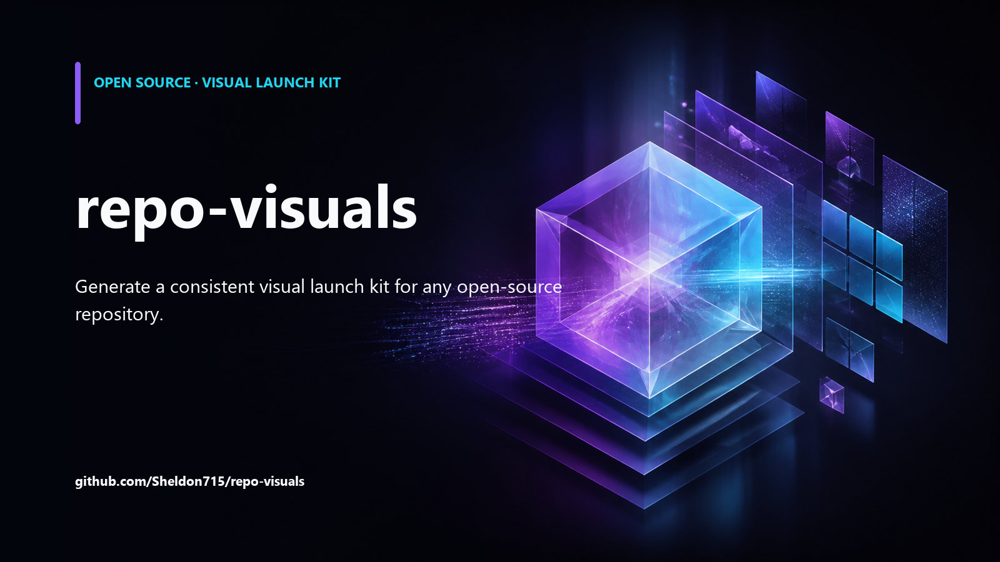
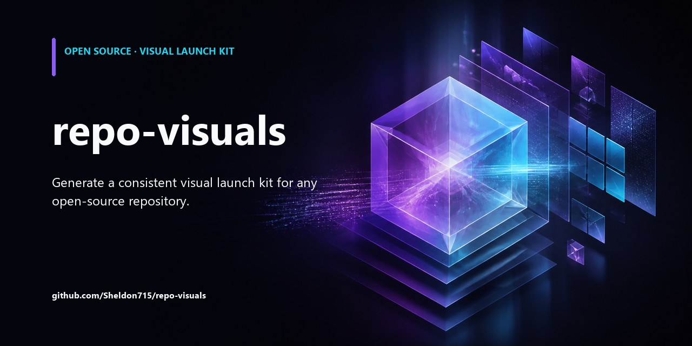
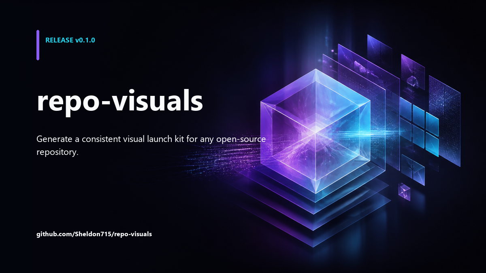

# repo-visuals

Generate a consistent visual launch kit for an open-source repository with one Agent Skill.

repo-visuals turns repository context into three ready-to-use assets:

- a `1600 x 900` README hero
- a `1280 x 640` GitHub social preview
- a `1200 x 675` release announcement card

AI generates the artwork. A deterministic Pillow compositor adds the real project name, tagline, release number, and layout, so the final images do not depend on an image model spelling text correctly.

## Preview



| GitHub social preview | Release card |
| --- | --- |
|  |  |

## Install

Install from this repository after it is published:

```bash
npx skills add Sheldon715/repo-visuals@repo-visuals
```

Or copy `skills/repo-visuals` into the skills directory used by your agent.

Install the deterministic compositor dependency:

```bash
python -m pip install Pillow
```

The helper scripts require Python 3.11 or newer.

## Use

Ask your agent:

```text
Use $repo-visuals to create a visual launch kit for this repository.
```

You can provide a release and a visual direction:

```text
Use $repo-visuals to create a dark, editorial launch kit for v1.4.0.
Preserve the existing logo and violet brand color.
```

The Skill will:

1. inspect public-facing repository metadata;
2. create a reviewable visual brief;
3. generate one text-free master background with the available image tool;
4. compose all exact copy locally;
5. build a contact sheet and verify the output.

By default, generated files are written to `output/repo-visuals/` in the target project.

## Why this is not another image prompt

General image generators are good at visual concepts but unreliable at exact copy, repeatable sizing, safe areas, and coordinated exports. repo-visuals separates those jobs:

- **AI layer:** artwork, texture, depth, and visual direction
- **deterministic layer:** crop, contrast, typography, exact text, dimensions, and file size
- **review layer:** contact sheet plus manifest for reproducible updates

The source repository remains local. Only the compact visual prompt and user-selected reference images should be sent to the configured image-generation tool.

## Run the scripts directly

Create a manifest:

```bash
python skills/repo-visuals/scripts/inspect_repo.py . --out output/repo-visuals/manifest.json
```

After generating a text-free background:

```bash
python skills/repo-visuals/scripts/compose_visual.py \
  --manifest output/repo-visuals/manifest.json \
  --background path/to/background.png \
  --out-dir output/repo-visuals

python skills/repo-visuals/scripts/build_contact_sheet.py \
  --input-dir output/repo-visuals \
  --out output/repo-visuals/contact-sheet.png
```

PowerShell accepts the same commands on one line.

## Checks

```bash
python -m unittest discover -s tests -v
python C:/path/to/skill-creator/scripts/quick_validate.py skills/repo-visuals
```

## Scope of v0.1

The first release intentionally supports one coordinated visual direction and three repository-launch assets. It does not publish images, edit repository settings, generate logos, or make up product claims.

## License

MIT
