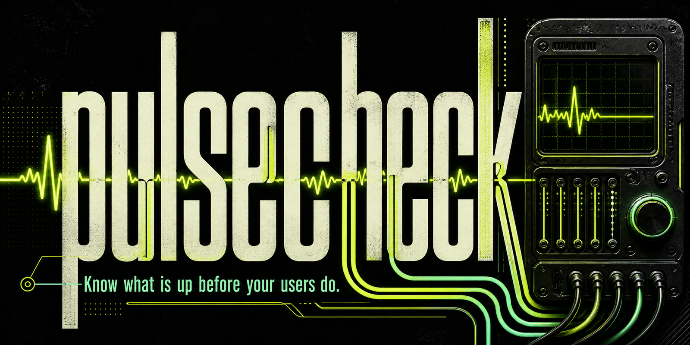
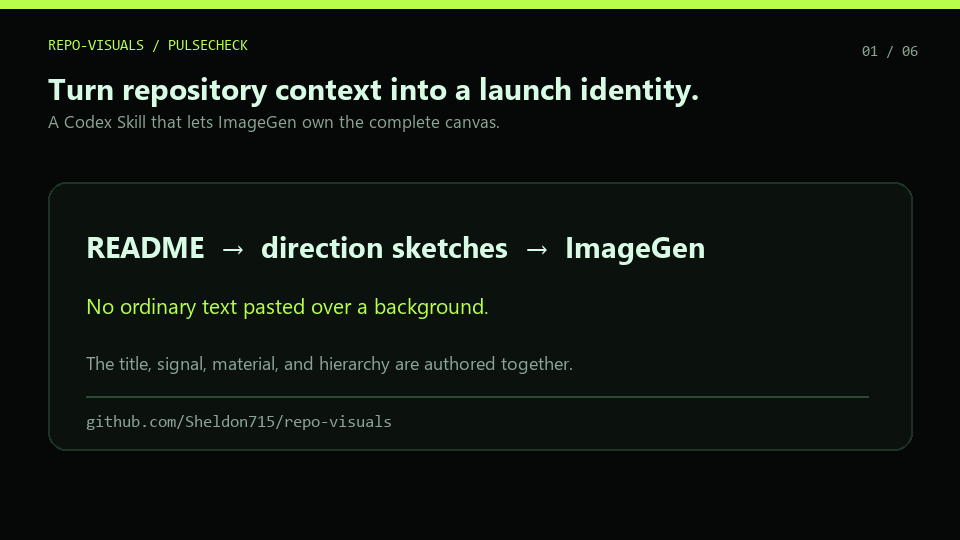

# repo-visuals

Make an open-source repository look like something people want to try.

[](https://github.com/Sheldon715/repo-visuals)
[](LICENSE)

`repo-visuals` is an Agent Skill that turns repository context into complete ImageGen launch designs. ImageGen owns the whole canvas—typography, composition, product metaphor, texture, and hierarchy—while the Skill controls the creative brief, exact copy, review gates, and cross-format consistency.





## The canvas is the design

Earlier versions generated background artwork and placed ordinary text on top. It was reliable, but it looked like a template.

V0.3 instead gives ImageGen a structured design sketch:

- what the product should become visually;
- how the grid and hierarchy behave;
- where typography interacts with the subject;
- exact text and punctuation;
- palette, material language, and anti-patterns.

For the Pulsecheck example, the title is the main visual object: monitoring signals pass through the letterforms and connect them to the diagnostic instrument. Nothing was locally typeset over this image.

The built-in ImageGen result was generated at `1774 × 887` with both requested lines rendered correctly.

## Full-canvas workflow

1. Inspect README and package metadata.
2. Plan three different concepts, each with its own sketch and typographic behavior.
3. Generate a complete direction poster for each concept.
4. Reject misspellings, extra words, weak hierarchy, generic text boxes, and invented claims.
5. Lock the selected complete artwork as the identity reference.
6. Generate each target aspect ratio as a new complete composition.
7. Resize or compress locally only after the authored design passes review.

If an image has one localized defect, the Skill requests a targeted edit while preserving everything else. It stops after two failed copy repairs instead of silently replacing the design with a template. The old deterministic compositor remains available only when the user explicitly prioritizes exact text over integrated art direction.

## Six launch formats

| Asset | Size | Typical use |
| --- | ---: | --- |
| README hero | 1600 × 900 | Repository landing page |
| GitHub social preview | 1280 × 640 | Link unfurls and sharing |
| Release card | 1200 × 675 | Releases and changelogs |
| Product gallery | 1270 × 760 | GitHub and marketplace galleries |
| Launch post | 1200 × 1500 | Social launch posts |
| Community square | 1080 × 1080 | Community directories and announcements |

Portrait and square outputs are regenerated for their own composition—not cropped from one universal background.

## Install

```bash
npx skills add https://github.com/Sheldon715/repo-visuals/tree/main/skills/repo-visuals
# Or use the repository shorthand:
# npx skills add Sheldon715/repo-visuals@repo-visuals
python -m pip install Pillow
```

The direct path works with the open `skills` CLI across Codex, Claude Code,
Cursor, OpenCode, and other compatible agents.

Python 3.11 or newer is required.

## Use

```text
Use $repo-visuals to create three complete launch directions for this repository.
Make the typography part of the artwork, then adapt the selected identity
into a README hero, GitHub social preview, and launch post.
```

You can add constraints:

```text
Keep our cobalt brand color and existing logo. Avoid generic SaaS gradients.
Use only the product name, tagline, and v1.4.0—do not invent claims.
```

Generated files default to `output/repo-visuals/`. Repository source stays local; only compact prompts and explicitly selected image references go to the configured image-generation tool.

## Run the planning scripts

```bash
python skills/repo-visuals/scripts/inspect_repo.py . \
  --out output/repo-visuals/manifest.json

python skills/repo-visuals/scripts/plan_directions.py \
  --manifest output/repo-visuals/manifest.json \
  --out output/repo-visuals/directions.json
```

After approving a complete direction poster:

```bash
python skills/repo-visuals/scripts/lock_direction.py \
  --manifest output/repo-visuals/manifest.json \
  --directions output/repo-visuals/directions.json \
  --select signal-terminal \
  --artwork output/repo-visuals/signal-terminal/complete-poster.png \
  --out output/repo-visuals/visual-lock.json

python skills/repo-visuals/scripts/plan_assets.py \
  --lock output/repo-visuals/visual-lock.json \
  --out output/repo-visuals/asset-prompts.json
```

Export an approved, aspect-ratio-matched ImageGen result:

```bash
python skills/repo-visuals/scripts/export_generated.py \
  --input output/repo-visuals/github-social-generated.png \
  --width 1280 --height 640 --format JPEG \
  --out output/repo-visuals/github-social.jpg
```

## V0.3

- complete ImageGen compositions replace background-plus-text templates;
- direction plans now include explicit grid, type-zone, visual-zone, and hierarchy sketches;
- exact-copy QA and bounded targeted retries;
- aspect-specific full-canvas prompt generation;
- identity-reference workflow for consistent future assets;
- ratio-safe export that refuses destructive crops.

The Skill does not publish images, edit repository settings, generate logos, or invent product claims.

## Checks

```bash
python -m unittest discover -s tests -v
python C:/path/to/skill-creator/scripts/quick_validate.py skills/repo-visuals
```

Regenerate the shareable workflow demo with:

```bash
python examples/pulsecheck/build_demo_gif.py
```

## License

MIT
